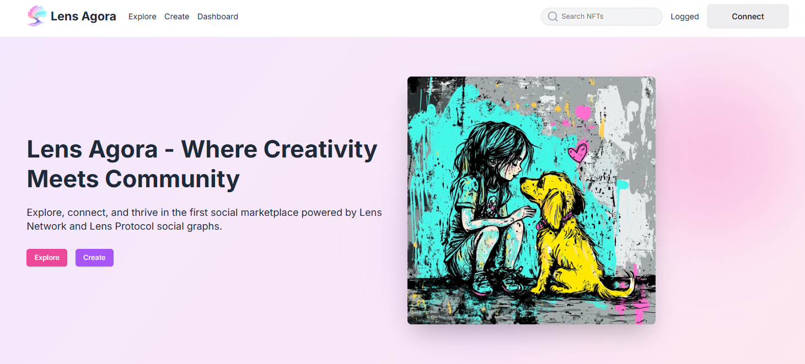

Lens Agora is a revolutionary marketplace built on the Lens Network, combining the power of social interaction with a seamless NFT trading experience. This platform is designed to empower creators and collectors by providing tools and features that set it apart from traditional marketplaces.

### Key Features
1.  **Socials Powered by Lens Network and Lens Protocol:**  
    Lens Agora leverages the Lens Network's fast and cheap transactions along with Lens Protocol's social graph to enable creators and collectors to connect, interact, and build trust. Users can create, like, comment, trade, and share NFTs directly within the platform, creating a vibrant, community-driven experience. Agora will also be registered as a Lens Protocol App as soon as this option is available, providing users with seamless access to the Lens ecosystem's full suite of features, including enhanced social interactions, account integration, and group functionalities.
    
2.  **Minting Options:**  
    Users can choose from deploying a 1/1 collection, a multi-edition collection, or organizing drops with customized minting phases. This flexibility allows creators to tailor their offerings to their audience's needs.
    
3.  **Organized Drops with Claiming Phases:**  
    Lens Agora provides creators with the ability to structure drops into phases, offering a smooth and professional experience for their audience.
    
4.  **Multi-Edition and Single-Edition Support:**  
    Whether it’s a 1/1 artwork or a series of limited editions, Lens Agora makes it easy for creators to mint and manage their collections.
    
5.  **Token-Gated Groups for Collections:**  
    Creators can establish exclusive, token-gated groups for their collections, powered by Lens Groups. This fosters closer engagement with collectors and adds value to their work by creating a sense of exclusivity.
    
6.  **Collector Groups with Paid Subscriptions:**  
    Also powered by Lens Groups, the platform enables the formation of collector groups with subscription options. This allows collectors to pool resources, share insights, and co-invest in their favorite NFTs.
    
7.  **Curated Galleries:**  
    Lens Agora empowers users to curate their own galleries, showcasing their favorite NFTs in a personalized and visually appealing way. These galleries can be shared with others, further enhancing social interaction.

### **Technical Features**

1.  **Custom Contract Deployment:**  
    Users can deploy their own smart contracts on Lens Network, giving them full control over their collections. This feature allows for unique customization and flexibility in how drops are organized.
    
2.  **Lens Protocol mockups**
    
    Lens Protocol functionalities like Groups, Apps, Feeds, and Accounts are represented in this project as mockups. Many of these features are not yet available in their full form to meet my intentions for Lens Agora. However, these mockups faithfully represent these functionalities based on the Lens Documentation.

    